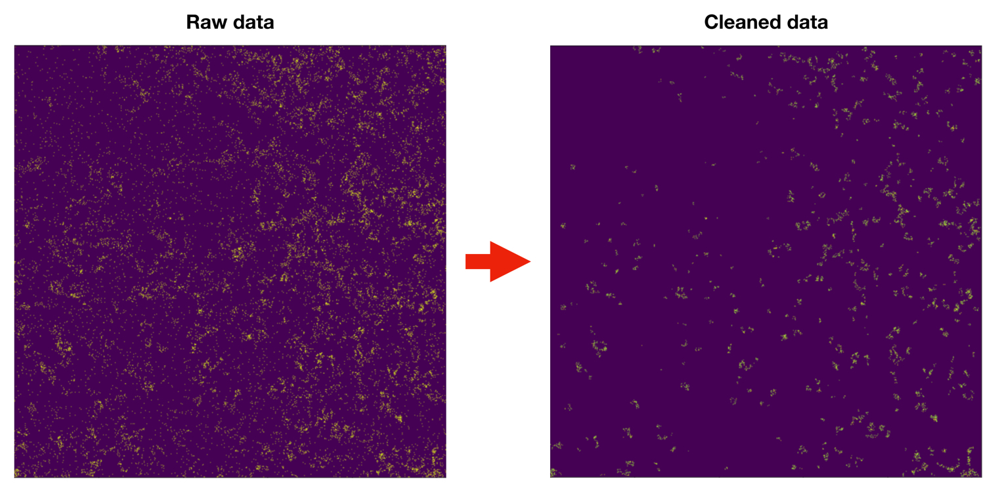

# Multiplex Ion Beam Imaging pre-processing tool - Python version 

This tool is for Multiplex Ion Beam Imaging (MIBI) data preprocessing and represents the Python 3 implementation of the original MATLAB version (https://github.com/lkeren/MIBIAnalysis) from [Keren et al. Cell 2018](https://www.ncbi.nlm.nih.gov/pubmed/30193111). Check the [jupyter notebook](https://nbviewer.jupyter.org/github/dpeerlab/MIBI_pre-processing_pipeline/blob/master/code/MIBI_preprocessing_demo-2019-11-03.ipynb) in the code folder to see usage examples. The preprocessing pipline includes background subtraction, noise removal and aggregate removal.

Versions of the package used in this tool:
scikit-learn==0.21.2
Pillow==6.0.0
pandas==0.24.2
numpy==1.16.0
matplotlib==3.1.0
scikit-image==0.16.2
scipy==1.2.1

Last update: 2019.11.03

## Example

## Background subtraction: 

The background across all channels in MIBI images is highly similar to the blank channel and is usually located in bare areas on the slide. If not carefully handled, this noise can obscure signal in the data. First, we define the blank channel (no antibody, usually mass 128-132) as the background channel. Then the background image is smoothed using a Gaussian kernel with 3-pixel radius and masked as a binary image using a thresholding method. All signals in other channels are then subtracted by two counts, and finally, we recover negative counts as 0. Some channels have special background noise, which is usually from strong signal channels like gold. The same procedure should also be applied to these channels with the target channel as the background channel.

## Noise removal: 

Signal in MIBI data can have very low intensity values, even single counts, and it can also be very sparse. This property makes the noise and true signal in the data very similar. To address this challenge in noise removal, we examine signal density instead of signal intensity. For each pixel in the image, we calculate the distance to the nearest 25 counts. By thresholding the distribution of the distance using a bimodal distribution method, the counts with low confidence are removed.

## Aggregate removal:

During staining, some antibodies aggregate and exhibit dense, punctate staining. These signals are not true signal and needs to be removed. We apply a Gaussian kernel with a 1-pixel radius and binarize the image using the Otsu thresholding method. By apply a threshold based on the area of connected components, these small aggregates can be removed. However, this step is optional. It depends on the marker properties and staining quality. If not correctly used, it can remove real signal.
(Note that we fixed a bug in Keren et al. Cell 2018 code that leads to failure to remove aggregates.)

## Acknowledgement 
This work is supported by the Parker Institute for Cancer Immunotherapy
